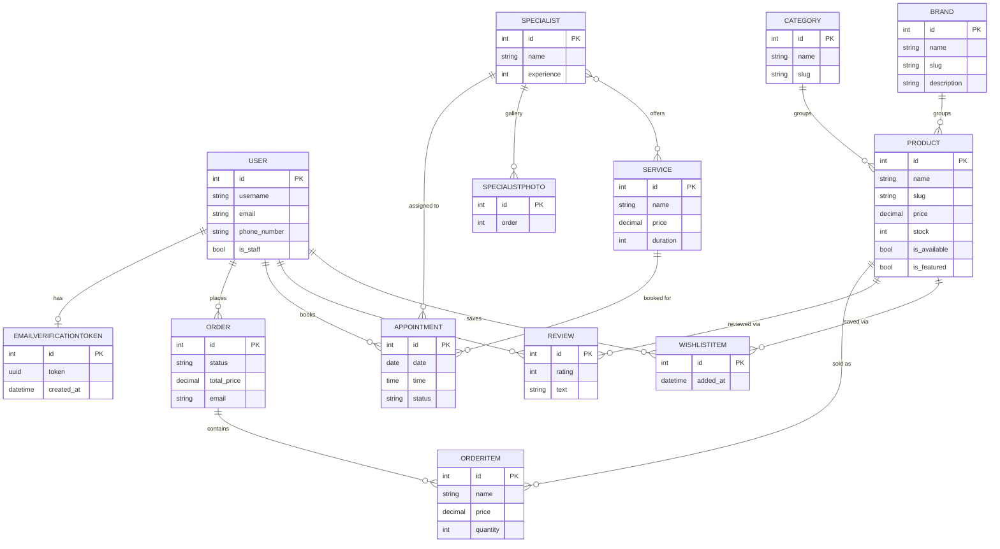

# Beauty Store

A full-featured beauty e-commerce & booking platform built with Django — a cosmetics shop with reviews and wishlists, an online booking system for cosmetology services, and a separate owner dashboard for store analytics and product management. Access to the storefront is gated behind sign-in (with a one-click demo login in development mode), which makes it easy to share as a portfolio demo without exposing it publicly. The UI is fully localized in English and Ukrainian.

## Live Demo

> _Screenshot of home page_
>
> _(add screenshots after running locally)_

---

## Features

**Shop**
- Browse brands, then filter that brand's products by category or search
- Product detail pages with images, ratings, and reviews
- Wishlist — save / remove products (auth required)
- Session-based shopping cart (add / update / remove)
- Checkout flow with delivery details
- Order history for authenticated users

**Booking**
- Browse available cosmetology services with pricing and duration
- Specialist profiles with photo, bio, gallery, and linked services
- Book appointments (date + time + comment)
- View, edit, and cancel pending appointments from personal cabinet

**Accounts**
- Registration with email verification (token-based, expires after 24h)
- Login / logout, personal profile page
- Order history and appointment list in one place
- The storefront requires sign-in to browse; in `DEBUG` mode any email/password creates and logs in a throwaway demo account for quick evaluation

**Owner Dashboard**
- Separate owner login, independent of regular user accounts
- Store analytics: revenue, order count, appointments (incl. pending), products, items sold, top-selling products
- Recent orders and appointments overview
- Full product CRUD (create / edit / delete), outside of the Django admin

**Localization**
- English / Ukrainian language switch (Django i18n + `LocaleMiddleware`)

**Admin panel**
- Full CRUD for products, categories, brands
- Order management with inline order items and status editing
- Appointment management with date hierarchy and status filter

---

## Tech Stack

- **Backend:** Python 3.12+ / Django 6.0.6
- **Database:** SQLite (dev) — swap `DATABASES` for PostgreSQL in production
- **Frontend:** Bootstrap 5.3, custom CSS (light/dark theme)
- **Images:** Pillow for image uploads
- **Config:** python-decouple (`.env`-based settings)

---

## Installation

```bash
git clone https://github.com/VadymVolynko/django-beauty-store
cd django-beauty-store

python -m venv venv
# Windows:
venv\Scripts\activate
# macOS / Linux:
source venv/bin/activate

pip install -r requirements.txt

cp .env.example .env
# then edit .env: set DJANGO_SECRET_KEY, and OWNER_LOGIN / OWNER_PASSWORD
# for access to the owner dashboard

python manage.py migrate
python manage.py createsuperuser   # optional — for Django admin access
python manage.py populate_db       # optional — seeds sample catalog & booking data
python manage.py runserver
```

Open [http://127.0.0.1:8000](http://127.0.0.1:8000) in your browser. The storefront requires sign-in — in development (`DJANGO_DEBUG=True`) any email/password combination logs you in as a demo user, or sign in with your `OWNER_LOGIN` / `OWNER_PASSWORD` for the owner dashboard.

---

## Project Structure

```
beauty-store/
├── config/          # Django settings, root URLs, wsgi
├── catalog/         # Product, Category, Brand models + views, owner product management
├── cart/            # Session-based cart logic
├── orders/          # Order & OrderItem models, checkout views
├── booking/         # Service, Specialist, Appointment models + views
├── accounts/        # Auth views (register / login / profile / owner dashboard)
├── reviews/         # Product review & rating model + form
├── wishlist/        # Wishlist model + views
├── templates/       # All HTML templates
├── static/          # CSS, JS, images
├── media/           # Uploaded product/brand/specialist images
├── locale/           # EN/UA translation catalogs
├── docs/            # Data model notes
└── manage.py
```

---

## DB Structure



---

## Pages Screenshots

| Page | Description |
|------|-------------|
| `/` | Home — hero + featured products (sign-in required) |
| `/catalog/` | Brand list |
| `/catalog/brand/<slug>/` | Brand's products, filterable by category and search |
| `/catalog/<slug>/` | Product detail — add to cart, wishlist, reviews |
| `/cart/` | Shopping cart with quantity controls |
| `/checkout/` | Checkout form |
| `/orders/` | My orders (auth required) |
| `/wishlist/` | My wishlist (auth required) |
| `/booking/services/` | Services list with "Book now" |
| `/booking/specialists/` | Specialist profiles |
| `/booking/appointments/book/` | Appointment booking form |
| `/booking/appointments/` | My appointments (auth required) |
| `/accounts/login/`, `/accounts/register/` | Login / Register (tabs) |
| `/accounts/profile/` | User profile |
| `/owner/` | Owner dashboard — analytics, recent orders & appointments (owner login required) |
| `/catalog/owner/products/` | Owner product management — list, add, edit, delete |

> _Add screenshots for each page in the PR description_

---

## Contributing

PRs are welcome. Please open an issue first to discuss what you would like to change.
